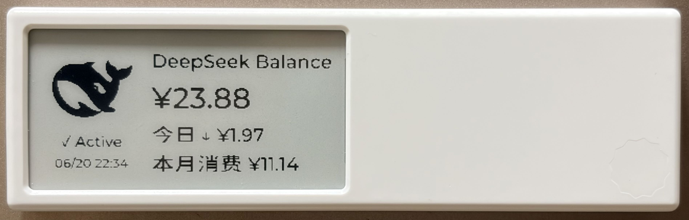

# DeepSeek Balance Dashboard for Quote/0

在 [MindReset Dot Quote/0](https://mindreset.tech/) 电子墨水屏上显示 DeepSeek API 账户余额和消费数据。

> **屏幕规格**：296×152 像素，125 PPI，4 级灰度

## 屏幕显示内容

```
┌──────────────────────────────────────────┐
│  ┌─────────┬──────────────────────────┐  │
│  │         │ DeepSeek Balance         │  │
│  │  🐋     │ ¥26.07                   │  │
│  │  75×75  │ 今日 ↓ ¥1.97             │  │
│  │         │ 本月消费 ¥11.14           │  │
│  │ ✓ Active│                          │  │
│  │ 06/20   │                          │  │
│  └─────────┴──────────────────────────┘  │
└──────────────────────────────────────────┘
```



- **左栏**：DeepSeek 图标 + 状态指示 + 更新时间戳
- **右栏**：标题 → 余额 → 今日消费 → 本月消费
- **API 异常时**：显示上次已知余额 + 错误信息，图标变暗

## 项目结构

```
quote0/
├── deepseek_balance/
│   ├── main.py              # 编排入口
│   ├── config.py            # 环境变量加载
│   ├── balance_api.py       # DeepSeek 余额 API 客户端
│   ├── history.py           # 余额历史快照 + 日消费计算
│   ├── usage_data.py        # 月消费跟踪（CSV 导入 + 增量更新）
│   ├── layout.py            # Canvas API 界面构建
│   └── dot_push.py          # Quote/0 设备推送
├── run_balance_check.sh     # cron 入口脚本
├── data/
│   ├── balance_history.json # 每日余额快照（自动生成）
│   └── usage_history.json   # 月消费数据（导入后生成）
├── logs/
│   └── balance_cron.log     # cron 运行日志
├── layout_editor.html       # WYSIWYG 布局编辑器（开发用）
└── pyproject.toml
```

## 首次初始化

### 1. 环境准备

```bash
# 克隆项目
git clone <repo-url> && cd quote0

# 创建虚拟环境（需要 uv 或 Python 3.10+）
uv venv
```

### 2. 获取 API Key

| Key | 来源 |
|-----|------|
| `DEEPSEEK_API_KEY` | [DeepSeek Platform](https://platform.deepseek.com/api_keys) → API Keys |
| `DOT_API_KEY` | MindReset Content Studio → 设备设置 → API 密钥 |
| `DOT_DEVICE_ID` | MindReset Content Studio → 设备详情 → 序列号 |

### 3. 设置环境变量

```bash
export DEEPSEEK_API_KEY="sk-xxxxxxxxxxxxxxxx"
export DOT_API_KEY="xxxxxxxxxxxxxxxx"
export DOT_DEVICE_ID="xxxxxxxxxxxxxxxx"
export CURRENCY="CNY"              # CNY 或 USD，默认 CNY
```

建议将以上命令写入 `~/.zshrc` 或 `~/.bashrc`，避免每次手动导出。

### 4. 导入当月用量数据

访问 [DeepSeek Usage 页面](https://platform.deepseek.com/usage)，下载当月用量报告（ZIP 格式），放入项目根目录后执行：

```bash
./run_balance_check.sh --import-usage usage_data_2026_6.zip
```

输出示例：
```
Imported 13 days of cost data from usage_data_2026_6.zip
Month: 2026-06
Month-to-date total: ¥11.14
Last date covered: 2026-06-20
Saved to data/usage_history.json
```

> **说明**：这一步只需在首次部署当月执行一次。次月起程序会自动从余额快照累加计算月消费，**无需再次导入 ZIP**。

### 5. 验证

```bash
# 预览 JSON 输出（不推送到设备）
./run_balance_check.sh --dry-run

# 首次正式推送
./run_balance_check.sh
```

## 日常运行

### 方式一：个人电脑定时推送

```bash
# 编辑 crontab
crontab -e

# 每天早上 8:00 运行
0 8 * * * /path/to/quote0/run_balance_check.sh
```

macOS 用户注意：cron 不会自动加载 shell 环境变量，需在脚本开头或 crontab 中显式设置。

### 方式二：服务器部署

```bash
# SSH 到服务器，克隆项目，同上完成初始化后：
crontab -e

# 服务器时区通常是 UTC，以下为北京时间 8:00（UTC 0:00）
0 0 * * * /path/to/quote0/run_balance_check.sh
```

### 日常命令参考

| 命令 | 用途 |
|------|------|
| `./run_balance_check.sh` | 完整运行（获取 + 存储 + 推送） |
| `./run_balance_check.sh --dry-run` | 仅打印 JSON，不推送 |
| `./run_balance_check.sh --import-usage <zip>` | 导入 DeepSeek 月度用量报告 |

## 数据文件说明

### `data/balance_history.json`

每次运行保存余额快照，用于计算每日消费和错误恢复：

```json
{
  "snapshots": [
    {
      "date": "2026-06-20",
      "total_balance": "26.07",
      "currency": "CNY",
      "is_available": true,
      "recorded_at": "2026-06-20T08:00:00"
    }
  ]
}
```

- 保留最近 90 天
- 文件损坏时自动备份到 `.bak` 后重建

### `data/usage_history.json`

导入或自动累积的月消费数据：

```json
{
  "monthly_cost": {"2026-06": "11.14"},
  "last_updated_date": "2026-06-20",
  "imported_daily_costs": {"2026-06-01": "0.43", ...}
}
```

- `monthly_cost`：各月累计消费
- `last_updated_date`：最后数据覆盖日期（防重复累加）
- `imported_daily_costs`：从 CSV 导入的每日明细

## 消费数据计算逻辑

### 今日消费

```
优先：导入的 CSV 中今天的实际扣费
回退：昨日余额 - 今日余额（余额快照差）
```

### 本月消费

```
导入当月 CSV 时：CSV 中所有日期的消费总和
后续每日运行：导入总额 + 导入日期之后的余额增量
次月自动归零，从余额快照重新累积
```

### 防重复机制

从 CSV 导入的数据已包含截至某日（如 6/20）的所有消费。程序只累加该日期**之后**新产生的余额变动，避免同一笔消费重复计数。

## 错误处理

| 错误类型 | 屏幕显示 |
|----------|----------|
| API Key 无效 | `--.--` + "Invalid DeepSeek API key" |
| 网络异常 | `--.--` + "DeepSeek service unavailable" |
| 数据解析失败 | `--.--` + "Invalid balance data received" |
| 有历史数据时 | 显示上次余额，如 `¥26.07 (06/19)` |

状态文字始终显示 `✗ Offline`，图标变暗 40%。

## 技术选型

- **零外部依赖**：仅使用 Python 标准库（`urllib`, `json`, `decimal`, `csv`, `zipfile`）
- **Decimal 精度**：所有金额计算使用 `Decimal`，避免浮点精度问题
- **先存后推**：先保存历史快照再推送屏幕，确保数据不丢失
- **优雅降级**：API 不可用时仍推送错误状态，并利用本地历史数据显示上次余额
