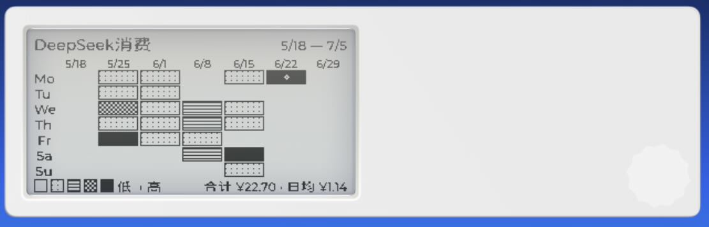
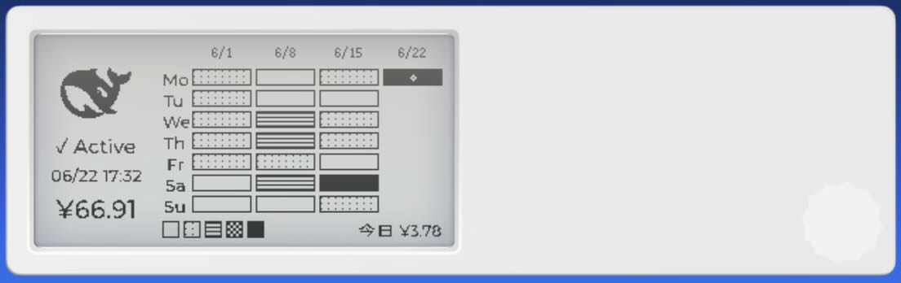

# DeepSeek Balance Dashboard for Quote/0

在 [MindReset Dot Quote/0](https://mindreset.tech/) 电子墨水屏上显示 DeepSeek API 账户余额和消费数据，提供三种视图轮换使用。

> **屏幕规格**：296×152 像素，125 PPI，实际只有黑白两色（无法渲染灰阶）

## 视图概览

| 视图 | CLI 标志 | 说明 |
|------|----------|------|
| 余额仪表盘 | （默认，无标志） | 双栏布局：图标 + 余额 + 今日/本月消费 |
| 30 日热力图 | `--heatmap` | 7 列 GitHub 风格热力图，展示近 30 天每日消费 |
| 综合仪表盘 | `--dashboard` | 左栏余额 + 右栏 4 列 × 7 行 28 天热力图 |

### 1. 余额仪表盘（默认视图）

```
┌──────────────────────────────────────────┐
│  ┌─────────┬──────────────────────────┐  │
│  │         │ DeepSeek Balance         │  │
│  │  🐋     │ ¥26.07                   │  │
│  │  75×75  │ 今日 ↓ ¥1.97             │  │
│  │         │ 本月消费 ¥11.14           │  │
│  │ ✓ Active│                          │  │
│  │ 06/20   │                          │  │
│  └─────────┴──────────────────────────┘  │
└──────────────────────────────────────────┘
```


- **左栏**：DeepSeek 图标 + 状态指示 + 更新时间戳
- **右栏**：标题 → 余额 → 今日消费 → 本月消费
- **API 异常时**：显示上次已知余额 + 错误信息，图标变暗

### 2. 30 日热力图 (`--heatmap`)



GitHub 风格热力图，7 列（周一~周日）展示近 30 天 DeepSeek API 消费强度。

- 5 级二元图案填充（加号点阵 → 横纹 → 棋盘格 → 全黑），在单色墨水屏上区分消费等级
- 每列顶部标注该周起始日期
- 热度阈值动态计算：≥10 个有效数据时按四分位数（P25/P50/P75）均分，小样本回退到最大值固定比例
- 图例行显示 5 级色块 + 30 天合计与日均

### 3. 综合仪表盘 (`--dashboard`)



余额 + 热力图合并视图，一屏展示完整信息。

- **左栏**（70px）：图标 50×50 + 状态 + 时间 + 余额
- **右栏**：4 列 × 7 行 28 天热力图，最后一列始终为当前周
- 未来日期留空，图例仅显示 5 级色块 + 今日消费

## 项目结构

```
quote0/
├── deepseek_balance/
│   ├── main.py              # 编排入口（三视图调度）
│   ├── config.py            # 环境变量加载
│   ├── balance_api.py       # DeepSeek 余额 API 客户端
│   ├── history.py           # 余额历史快照 + 日消费计算
│   ├── usage_data.py        # 月消费跟踪（CSV 导入 + 增量更新）
│   ├── layout.py            # 余额仪表盘 Canvas 界面构建
│   ├── heatmap.py           # 热力图 PNG 生成 + Payload 构建
│   ├── dashboard.py         # 综合仪表盘（余额 + 28 天热力图）
│   ├── nfc_report.py        # NFC 触碰纯文本消费报告
│   └── dot_push.py          # Quote/0 设备推送
├── run_balance_check.sh     # cron 入口脚本
├── .env                      # 密钥配置（不提交，chmod 600）
├── data/
│   ├── balance_history.json # 每日余额快照（自动生成）
│   └── usage_history.json   # 月消费数据 + 导入的每日明细
├── logs/
│   └── balance_cron.log     # cron 运行日志
└── pyproject.toml
```

## 首次初始化

### 1. 环境准备

```bash
# 克隆项目
git clone <repo-url> && cd quote0

# 创建虚拟环境（需要 uv 或 Python 3.10+）
uv venv
```

### 2. 获取 API Key

| Key | 来源 |
|-----|------|
| `DEEPSEEK_API_KEY` | [DeepSeek Platform](https://platform.deepseek.com/api_keys) → API Keys |
| `DOT_API_KEY` | MindReset Content Studio → 设备设置 → API 密钥 |
| `DOT_DEVICE_ID` | MindReset Content Studio → 设备详情 → 序列号 |

### 3. 配置 `.env` 文件

```bash
# 在项目根目录创建 .env 文件（已在 .gitignore，不会被提交）
cat > .env << 'EOF'
DEEPSEEK_API_KEY="sk-xxxxxxxxxxxxxxxx"
DOT_API_KEY="xxxxxxxxxxxxxxxx"
DOT_DEVICE_ID="xxxxxxxxxxxxxxxx"
CURRENCY="CNY"              # CNY 或 USD，默认 CNY
EOF

# 收紧权限，防止其他用户读取
chmod 600 .env
```

> `.env` 会被 `run_balance_check.sh` 自动加载。终端手动运行和 crontab 定时任务都无需额外设置环境变量。

### 4. 导入当月用量数据

访问 [DeepSeek Usage 页面](https://platform.deepseek.com/usage)，下载当月用量报告（ZIP 格式），放入项目根目录后执行：

```bash
./run_balance_check.sh --import-usage usage_data_2026_6.zip
```

输出示例：
```
Imported 13 days of cost data from usage_data_2026_6.zip
Month: 2026-06
Month-to-date total: ¥11.14
Last date covered: 2026-06-20
Saved to data/usage_history.json
```

> **说明**：这一步只需在首次部署当月执行一次。次月起程序会自动从余额快照累加计算月消费，**无需再次导入 ZIP**。

### 5. 验证

```bash
# 预览 JSON 输出（不推送到设备）
./run_balance_check.sh --dry-run

# 首次正式推送
./run_balance_check.sh
```

## 日常运行

### Crontab 定时推送

密钥已由脚本从 `.env` 自动加载，crontab 只需配置执行时间即可。示例 — 三视图轮换推送：

```bash
crontab -e
```

```
# 余额仪表盘 + 综合仪表盘 + 热力图，每天各 3 次（北京时间，服务器为 UTC）
# 余额仪表盘：8:00 / 14:00 / 23:00
0   0 * * * /home/ubuntu/quote0-deepseek-balance/run_balance_check.sh
0   6 * * * /home/ubuntu/quote0-deepseek-balance/run_balance_check.sh
58 14 * * * /home/ubuntu/quote0-deepseek-balance/run_balance_check.sh

# 综合仪表盘：10:00 / 18:00
0   2 * * * /home/ubuntu/quote0-deepseek-balance/run_balance_check.sh --dashboard
0  10 * * * /home/ubuntu/quote0-deepseek-balance/run_balance_check.sh --dashboard

# 热力图：每天一次（23:00 全天数据完备后）
59 14 * * * /home/ubuntu/quote0-deepseek-balance/run_balance_check.sh --heatmap
```

> 脚本内已设置 `PATH` 并从 `.env` 加载密钥，无需在 crontab 中重复配置环境变量。服务器时区通常为 UTC，上例已将北京时间换算为 UTC。可根据需要调整三视图的推送频率和顺序。

### 日常命令参考

| 命令 | 用途 |
|------|------|
| `./run_balance_check.sh` | 余额仪表盘（默认视图） |
| `./run_balance_check.sh --dry-run` | 仅打印 JSON，不推送 |
| `./run_balance_check.sh --heatmap` | 30 日消费热力图 |
| `./run_balance_check.sh --dashboard` | 综合仪表盘（余额 + 28 天热力图） |
| `./run_balance_check.sh --import-usage <zip>` | 导入 DeepSeek 月度用量报告 |

> `--heatmap` 和 `--dashboard` 也支持 `--dry-run` 预览。

## 数据文件说明

### `data/balance_history.json`

每次运行保存余额快照，用于计算每日消费和错误恢复：

```json
{
  "snapshots": [
    {
      "date": "2026-06-20",
      "total_balance": "26.07",
      "currency": "CNY",
      "is_available": true,
      "recorded_at": "2026-06-20T08:00:00"
    }
  ]
}
```

- 保留最近 90 天
- 文件损坏时自动备份到 `.bak` 后重建

### `data/usage_history.json`

导入或自动累积的月消费数据：

```json
{
  "monthly_cost": {"2026-06": "11.14"},
  "last_updated_date": "2026-06-20",
  "imported_daily_costs": {"2026-06-01": "0.43", ...}
}
```

- `monthly_cost`：各月累计消费
- `last_updated_date`：最后数据覆盖日期（防重复累加）
- `imported_daily_costs`：从 CSV 导入的每日明细

## 消费数据计算逻辑

### 今日消费

```
优先：导入的 CSV 中今天的实际扣费
回退：昨日余额 - 今日余额（余额快照差）
```

### 本月消费

```
导入当月 CSV 时：CSV 中所有日期的消费总和
后续每日运行：导入总额 + 导入日期之后的余额增量
次月自动归零，从余额快照重新累积
```

### 防重复机制

从 CSV 导入的数据已包含截至某日（如 6/20）的所有消费。程序只累加该日期**之后**新产生的余额变动，避免同一笔消费重复计数。

## 错误处理

| 错误类型 | 屏幕显示 |
|----------|----------|
| API Key 无效 | `--.--` + "Invalid DeepSeek API key" |
| 网络异常 | `--.--` + "DeepSeek service unavailable" |
| 数据解析失败 | `--.--` + "Invalid balance data received" |
| 有历史数据时 | 显示上次余额，如 `¥26.07 (06/19)` |

状态文字始终显示 `✗ Offline`，图标变暗 40%。

## 技术选型

- **零外部依赖**：仅使用 Python 标准库（`urllib`, `json`, `decimal`, `csv`, `zipfile`）
- **PNG 生成**：纯 Python 标准库（`struct` + `zlib`）构建灰度 PNG，无需 Pillow
- **二元图案填充**：热力图在单色墨水屏上通过点阵、横纹、棋盘格等图案区分 5 级消费强度，而非依赖灰阶抖动
- **Decimal 精度**：所有金额计算使用 `Decimal`，避免浮点精度问题
- **先存后推**：先保存历史快照再推送屏幕，确保数据不丢失
- **优雅降级**：API 不可用时仍推送错误状态，并利用本地历史数据显示上次余额

## 墨水屏灰度方案说明

Quote/0 屏幕虽标称 4 级灰度，实测 Canvas API 对 `div` 颜色和 `img` 抖动处理均只能输出纯黑/纯白两色。因此热力图采用**二值图案填充**替代传统灰度：

| 等级 | 图案 | 密度 |
|------|------|------|
| 0 | 全白（空心） | 0% |
| 1 | 五点加号（5-dot plus） | ~17% |
| 2 | 水平条纹（每 3 行） | ~33% |
| 3 | 2×2 棋盘格 | 50% |
| 4 | 全黑 | 100% |

所有图案在 Python 中绘制到像素数组后编码为 PNG，以 `img` 元素推送到设备，配合 `img-dither-none img-levels-2` 类保持图案原样不被抖动破坏。所有热力格子统一使用 1px 黑色边框，今日格子不做特殊视觉标记。
